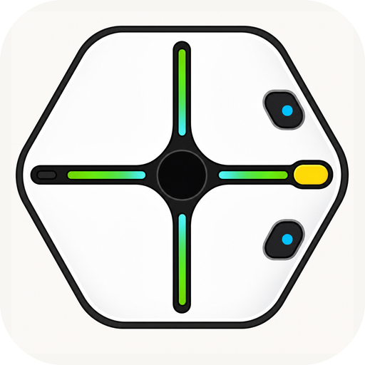

# iRobot Root for Xcratch

<p align="center">
  
</p>

<p align="center">
  iRobot Root rt0/rt1を、XcratchからBluetooth Low Energy（BLE）で制御する拡張機能です。
</p>

<p align="center">
  <a href="https://github.com/naominix/xcx-irobot-root/actions/workflows/ci.yml"></a>
  <a href="LICENSE"></a>
  <a href="https://xcratch.github.io/"></a>
</p>

## すぐに使う

ChromeまたはEdgeで、次のリンクを開きます。

**[Root専用XcratchでiRobot Root拡張を開く](https://naominix.github.io/xcratch-irobot-root/editor/)**

拡張機能URLを手動で指定する場合は、XcratchのExtension Loaderへ次を入力します。

```text
https://naominix.github.io/xcx-irobot-root/irobotRoot.mjs
```

1. Rootの電源を入れ、接続先の端末へ近づけます。
2. Xcratchで「Rootに接続する」ブロック、または拡張カテゴリ横のオレンジ色の接続ボタンを押します。
3. 一覧から接続するRootを選択します。
4. LEDや音などの安全な命令から動作を確認します。

> [!CAUTION]
> モーター命令を初めて試すときは、Rootを広い床へ置くか車輪を浮かせ、低速から確認してください。

## 対応環境

| 環境 | 接続方法 | 必要なもの |
|---|---|---|
| Windows / macOS / ChromeOS | Web Bluetooth | ChromeまたはEdge |
| macOS / Windows | Scratch Link | Scratch Link 2.xを起動 |
| iPadOS | App Store版ScrubのCoreBluetoothブリッジ | Scratch Link対応マーカーを持つエディター |

> [!IMPORTANT]
> **App Store版Scrubは無改造で利用できます。** 2026年7月26日、micro:bit More専用エディター上でRootとmicro:bit More v2を同時接続し、micro:bitのボタンからRootのLEDを制御できることを確認しました。

iPadOSのSafari単体では接続できません。また、接続先ページにはScrubが認識する`scratch-link-extension-script`マーカーが必要です。公式Xcratchエディターは2026年8月7日現在、この条件に対応済みのため、App Store版Scrubから無改造で利用できます。詳しくは[Scrub導入手順](docs/SCRUB.md)と[Xcratch対応案](docs/XCRATCH_SCRUB.md)を参照してください。

Rootは複数の端末へ同時接続できません。接続できない場合は、別のiPad、PC、公式アプリなどでRootを切断してから再試行してください。

## できること

- 複数のRootを検索し、一覧から接続先を選択
- 左右モーターの速度制御、距離移動、回転、弧、座標ナビ、停止
- マーカーと消しゴムの上げ下げ
- RGB LEDの点灯、消灯、点滅、回転
- ピアノ鍵盤または周波数と長さを指定した発音、ロボット語によるフレーズ発声
- バッテリー、照度、加速度の取得
- 左右バンパーのPush/Releaseと同時押しイベント
- FL/FR/RL/RRタッチセンサーのタッチ/リリースイベント
- 崖センサー、バッテリー関連イベント
- Root BLE protocolの任意コマンドを送るrawブロック
- Scratch/Xcratchの言語設定に連動する日本語・にほんご（ひらがな）・英語表示

## ブロックの使い方

### 接続

「Rootに接続する」を実行するとデバイス一覧が開きます。接続後、「Rootは接続済み」レポーターが真になります。「Rootを切断する」で明示的に切断できます。

### 移動

左右のモーター速度を個別に指定するほか、距離、角度、半径を使った移動ブロックを利用できます。直進・回転・円弧ブロックは、Rootから同じpacket IDの完了応答を受信してから次のブロックへ進みます。完了時は左右のモーター速度を明示的に0へ戻します。また、床面やペンの摩擦による微小な補正運転が続いて完了応答が返らない場合は、安全監視が移動を停止して次のブロックへ進めます。速度や距離は小さい値から試してください。

Root専用Xcratchでは、数値欄を選ぶとRootの動きを図で確認できるモーションピッカーが開きます。左右モーター出力、移動距離、回転角、円弧の半径・角度は、図をマウスまたは指でドラッグして指定できます。パネル内の数値欄から精密な値を直接入力でき、iPadでは数字キーボードまたは画面内テンキーも利用できます。従来どおり演算ブロックの差し込みも可能です。

公式XcratchとApp Store版Scrubでは、同じモーターブロックがScratch標準の数値欄として表示されます。すべての制御命令は利用でき、iPadでは数値欄をタップするとiPadOSの数字キーボードで入力できます。モーションピッカーはRoot専用Xcratchでのみ提供する強化UIです。ブロックの命令と保存される数値は共通なので、プロジェクトは両方のエディター間で利用できます。

「左モーター／右モーター」ブロックは速度を継続設定する命令です。停止させるには速度を両方0にするか、「Rootを停止する」ブロックを使用してください。BLE書き込みはRootセッションごとに短い内部キューで順序を保つため、LED直後の移動命令が書き込み競合で失われにくくなっています。

「ナビをリセットする」は、その位置を座標 `(0, 0)`、前方を正のY方向として拡張機能内の推定位置を初期化します。「ナビで x [X] y [Y] cmへ移動する」は、目標座標から必要な回転角と直進距離を計算し、Rootの回転・距離移動命令を順に実行してから次のブロックへ進みます。Xは開始時の右方向が正、Yは開始時の前方向が正です。Root rt0/rt1で利用でき、共有プロトコルのCommand 17への対応を必要としません。ロボットを手で動かした場合は、移動後の位置で「ナビをリセットする」をもう一度実行してください。

### Rootシミュレーター

「制御モードをシミュレーターにする」を実行すると、RootへBLE命令を送らずに、拡張機能内のRootシミュレーターが命令を再現します。「Rootシミュレーターを開く」で、座標、向き、LED、マーカー状態を確認できます。直進・回転・円弧・座標ナビ・マーカーの軌跡・LEDの点灯／点滅／回転に対応します。

シミュレーターでは、壁・ブロック障害物を配置して左右バンパーの衝突イベントを試せます。Rootの4つのタッチ領域をクリックまたはタップすると、タッチセンサーHATも発火します。実行速度は0.25〜4倍で調整でき、「もう一度実行」で緑の旗から再実行できます。

シミュレーター固定中もBLE接続は維持できますが、実機への制御命令および実機からのセンサーイベントは無視されます。実機を動かすときは、制御モードを「実機」に戻してください。

### LED・音・描画

Scratch標準のカラーピッカーでLEDの色を選び、点灯、点滅、回転アニメーションを指定できます。RGB値を直接入力する従来ブロックも上級者向けとして利用できます。音はScratch標準のピアノ鍵盤から音階を選ぶか、上級者向けの周波数（Hz）で指定できます。鍵盤を押すと、接続中のRootで短く試聴できます。「言う」ブロックは入力文字列を最大16 UTF-8バイトのロボット語として発声します。日本語などのマルチバイト文字は途中で分断せず、安全な文字境界で収めます。音階・周波数・発声ブロックはRootから同じpacket IDの再生完了応答を受信してから次へ進みます。マーカー／消しゴムは上げ下げブロックで操作します。

### センサーイベント

バンパーとタッチセンサーには、選択メニュー付きHATと、種類ごとの固定HATがあります。イベントはRootから受信したBLE通知パケットを解析して発火します。

### 実験機能: 複数Root（`multi-root`ブランチのみ）

`multi-root`ブランチでは、Rootごとに独立したBLEセッションを保持する実験実装を検証しています。「Rootに接続する」は1台目のスキャン、「別のRootを接続する」は既存接続を維持した追加スキャンとして動作します。「use [Root]」で操作対象を切り替え、既存の移動・LED・音・センサー・ナビブロックを選択中のRootへ送ります。選択ブロックはScratchの実行スレッドにRoot IDを記録するため、緑の旗から並列に開始したスクリプトでも、Root 1とRoot 2の命令が切り替わりません。バンパー／タッチセンサーHATにもRoot選択欄を追加し、通知元と異なるRootのHATは発火しないようにしています。各Rootのpacket ID、完了待ち、センサー状態、ナビ座標、切断処理はセッション単位です。切断済みセッションは再接続時に再利用するため、通常はRoot3へ増殖しません。接続ボタンを連続して押す前に、切断完了を待ってください。

この機能は技術検証用であり、`main`には未統合です。GitHub Pagesや公式配布物にはデプロイしていません。Web Bluetooth、Scratch Link、ScrubでのRoot実機2台同時接続は、環境ごとに以下の手順で人間による実機検証が必要です。

1. `multi-root`ブランチのリポジトリで依存関係をインストールし、`npm run build`を実行します。
2. 別途チェックアウトしたXcratchで、`npm --prefix packages/scratch-gui run start -- --port 8601`を実行し、開発サーバーのルート `https://localhost:8601/` を開きます。`/editor/`はGitHub Pages等の公開構成用で、webpack-dev-serverでは使用しません（Xcratchの構成により起動コマンド／URLが異なる場合があります）。
3. `dist/`をHTTPSで配信できるローカルサーバーから `irobotRoot.mjs` をExtension Loaderで読み込みます。例えば `npm run build`後に `python3 -m http.server 8700 --directory dist` を実行し、`http://localhost:8700/irobotRoot.mjs` を指定します。localhostはWeb Bluetoothのsecure contextとして扱われます。
4. Root Aを接続し、拡張機能の接続ボタン（オレンジ色の接続アイコン）を再度実行してRoot Bを接続します。「別のRootを接続する」ブロックは追加スキャンを開始しますが、一覧選択UIは接続ボタンから開いてください。
5. Root Aを選択して赤色LED、Root Bを選択して青色LEDを設定し、対象だけが変化することを確認します。
6. 移動完了、センサーイベント、片方だけの切断・再接続も同様に確認します。

Codexでは物理Rootを操作できないため、2台同時接続の実機結果は未確認です。今回のブランチでは自動テストとビルド結果、コードレビュー上の分離のみを報告します。

## サンプルプロジェクト

[example.sb3](projects/example.sb3)をダウンロードし、拡張機能を読み込んだXcratchで開いてください。

[root-unicorn-drawing.sb3](projects/root-unicorn-drawing.sb3)は、直進・回転・円弧とマーカー操作を順番に実行してユニコーンを描くサンプルです。変換内容は[サンプルの説明](projects/root-unicorn-drawing.md)を参照してください。


## 開発

Node.js 22以降を推奨します。XcratchのScratch VMソースを隣接ディレクトリへ配置します。

```sh
git clone https://github.com/xcratch/scratch-editor.git ../scratch-editor
npm --prefix ../scratch-editor install
npm install
npm run setup-dev
npm test -- --runInBand
npm run build
```

ビルド成果物は`dist/irobotRoot.mjs`です。詳しい構成と検証方法は[開発者向けドキュメント](docs/DEVELOPMENT.md)を参照してください。

## 技術概要

- Root識別サービス: `48c5d828-ac2a-442d-97a3-0c9822b04979`
- Nordic UARTサービス: `6e400001-b5a3-f393-e0a9-e50e24dcca9e`
- 20バイト、big-endian、packet ID、CRC-8
- PCではWeb Bluetoothを優先し、利用できない場合はScratch Linkへフォールバック
- iPadOSでは、対応マーカーによってScrubが公開する標準`Scratch.ScratchLinkSafariSocket`を優先
- 標準Socketが直接参照可能な互換環境では、Root拡張内だけのフォールバックも利用
- Bluetooth許可で最初の探索要求が失われた場合は、同じソケットで探索を再試行
- 直進（Command 8）、回転（Command 12）、円弧（Command 27）はpacket IDが一致する完了応答を待機
- 座標ナビは公式Python SDKのRoot向け方式と同様に位置・向きを拡張機能側で管理し、回転（Command 12）と直進（Command 8）へ変換
- 有限移動の完了時は左右モーター速度0を送信し、補正運転で完了しない場合は移動量に応じた安全監視で停止
- Scrub互換性のためBLE書き込みのJSON-RPC応答自体は待機せず、Rootからの通知だけを待機
- RootごとにBLE UART書き込みを独立キュー化し、応答を返さないScrubでも一定時間後に次のパケットへ進む

実装の基礎資料として、[Xcratch公式ドキュメント](https://xcratch.github.io/docs/ja/)、[Root BLE protocol](https://github.com/PoweredBySAM/sam-root-ble-protocol)、[Scratch Link](https://github.com/scratchfoundation/scratch-link)、[Scrub](https://github.com/bricklife/Scrub)を参照しています。

## 実機検証

Root rt0実機で、次を確認済みです。

- iPadOS + App Store版ScrubでのRoot接続
- App Store版Scrub上でのRootとmicro:bit More v2の同時接続・拡張間連携
- macOSでのWeb Bluetooth接続
- モーター、LED、音、マーカー／消しゴム命令
- バンパー／タッチHATイベント

自動テストでは、拡張メタデータ、日英切り替え、CRC、モーター／座標ナビの回転・直進変換、packet ID循環、移動完了応答とタイムアウト、センサーイベント判定、Scratch VMでのHATスレッド開始を検証します。

## ライセンス

[MIT License](LICENSE) © 2026 naominix

このプロジェクトはiRobotによる公式ソフトウェアではありません。iRobotおよびRootは各権利者の商標です。
